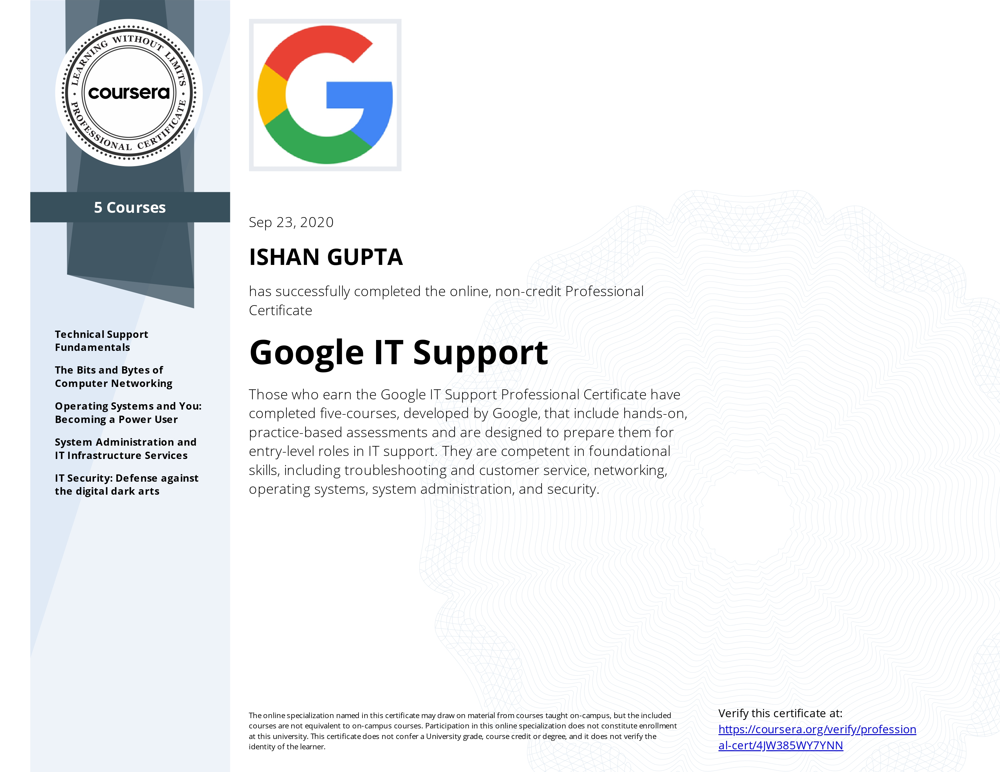
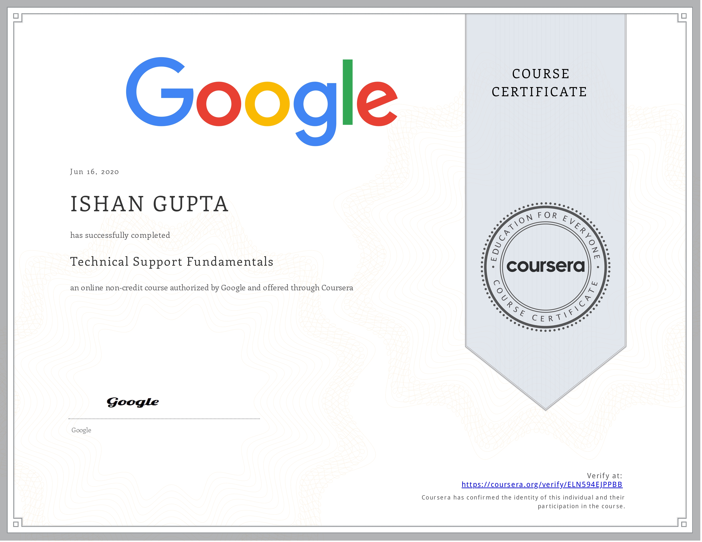
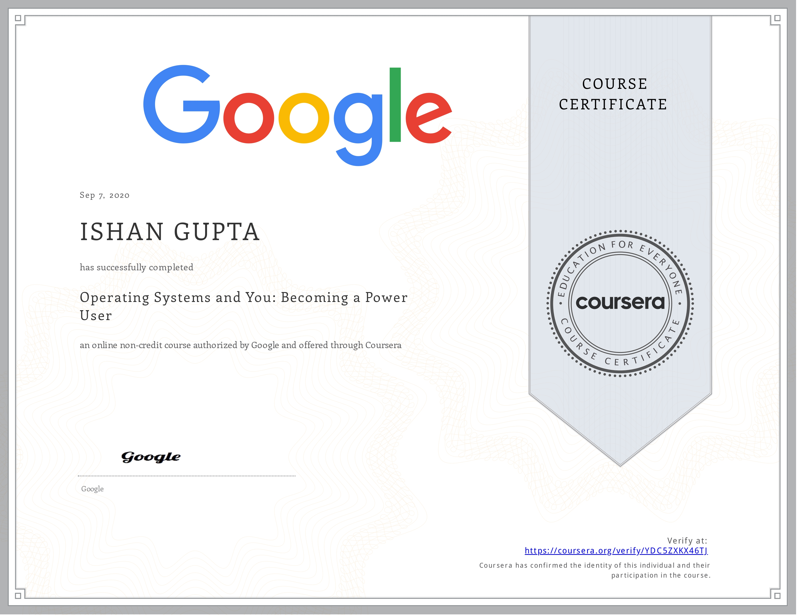
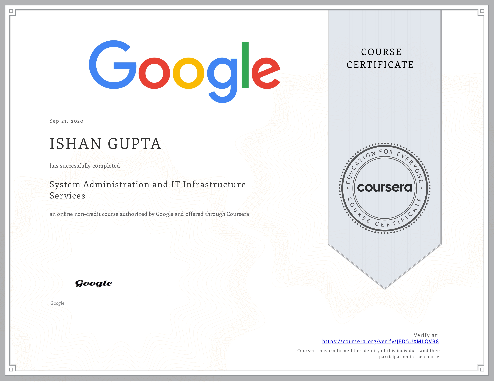
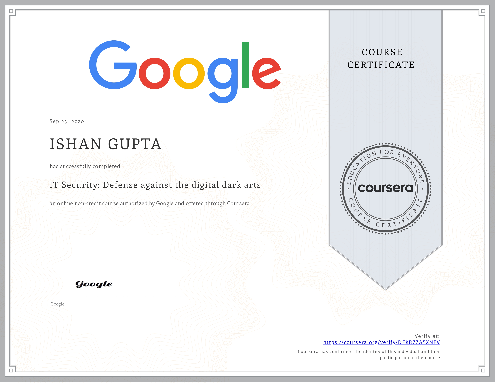

### [Verify](https://coursera.org/verify/professional-cert/4JW385WY7YNN)

This specializations required 5 certifications to be completed.

## Technical Support Fundamentals

### [Verify](https://coursera.org/verify/ELN594EJPPBB)

## The Bits and Bytes of Computer Networking

### [Verify](https://coursera.org/verify/NPE8TJ2TBGAV)

## Operating Systems and You: Becoming a Power User

### [Verify](https://coursera.org/verify/YDC5ZXKX46TJ)

## System Administration and IT Infrastructure Services

### [Verify](https://coursera.org/verify/JED5UXMLQVB8)

## IT Security: Defense against the digital dark arts

### [Verify](https://coursera.org/verify/DEKB7ZA5XNEV)
