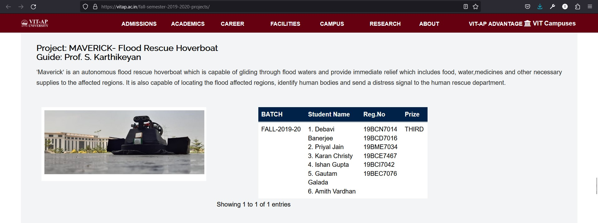

+++
date = "2019-11-15T22:25:02-07:00"
title = "MAVERICK"
image = "maverick.png"
alt = "MAVERICK- Flood Rescue Hoverboat"
color = "#f8f8f8"
link1 = ""
link2 = ""

+++

Guide: Prof. S. Karthikeyan

‘Maverick’ is an autonomous flood rescue hoverboat which is capable of gliding through flood waters and provide immediate relief which includes food, water,medicines and other necessary supplies to the affected regions. It is also capable of locating the flood affected regions, identify human bodies and send a distress signal to the human rescue department.

