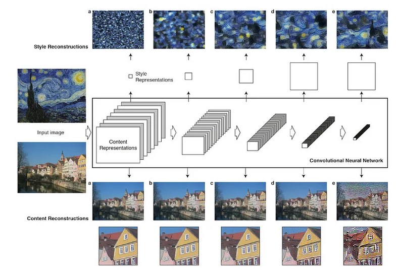

+++
date = "2021-07-15T22:25:16-07:00"
title = "StyleTransfer"
image = "styletransfer.png"
alt = "StyleTransfer"
color = "#263248"
link1 = ""
link2 = "https://github.com/ishan-gupt/StyleTransfer-Pytorch.git"

+++

### Tech Stack

- Python
- Jupiter
- Pytorch Library

### Neural Style Transfer Using PyTorch

Neural style transfer is an artificial system based on the Deep Neural Network to generate artistic images. This approach uses two random images, the content and the style image. It extracts the structural features from the content image, whereas the style features from the style image.

### The Model Architecture

